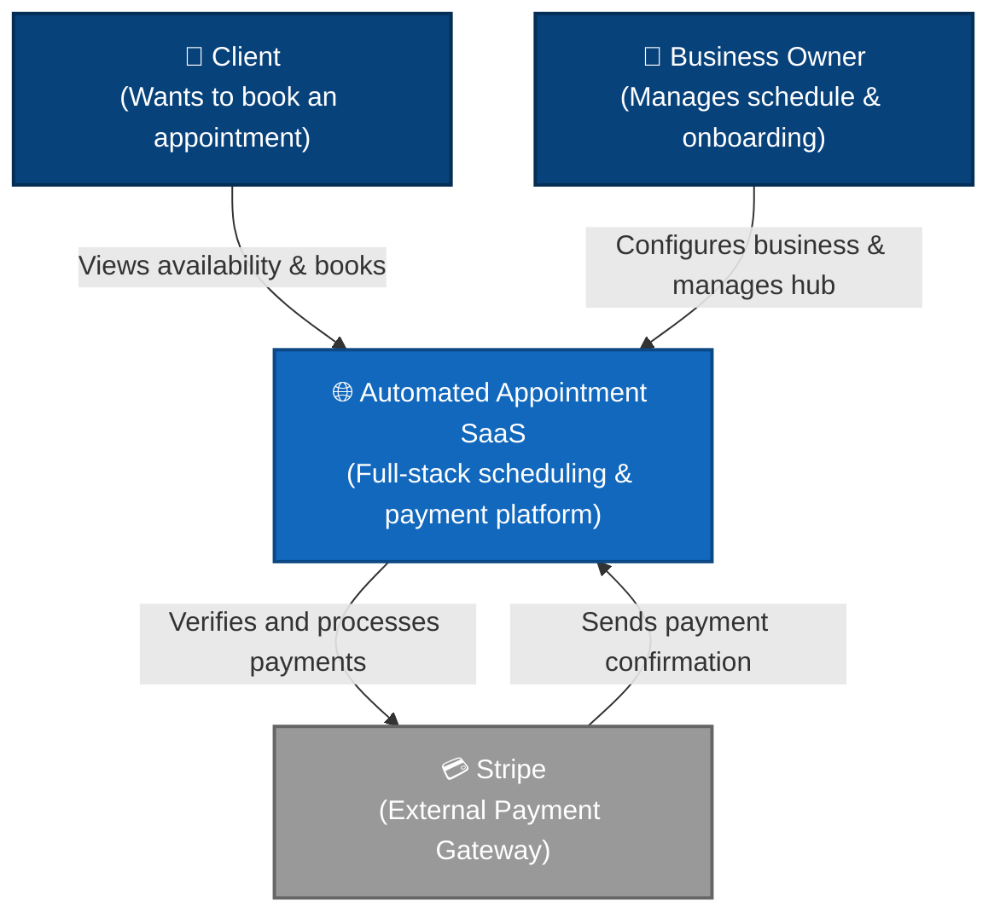
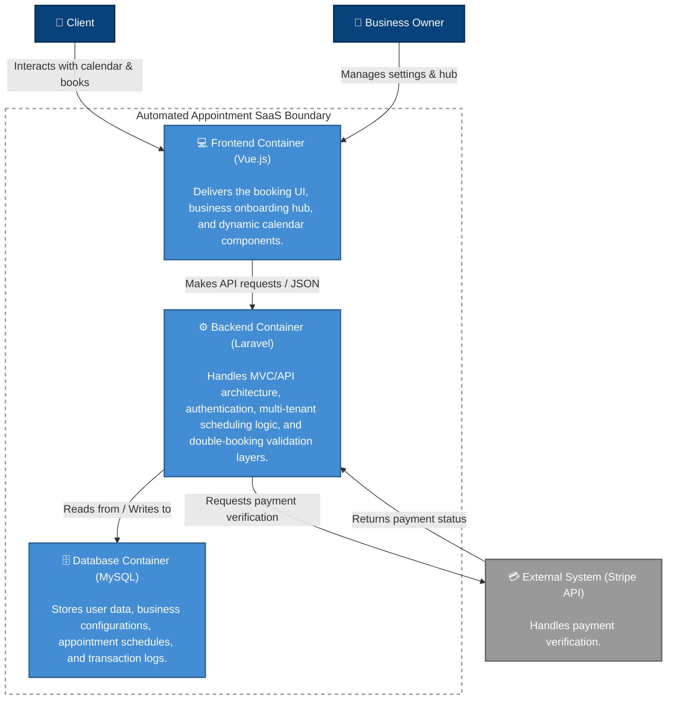
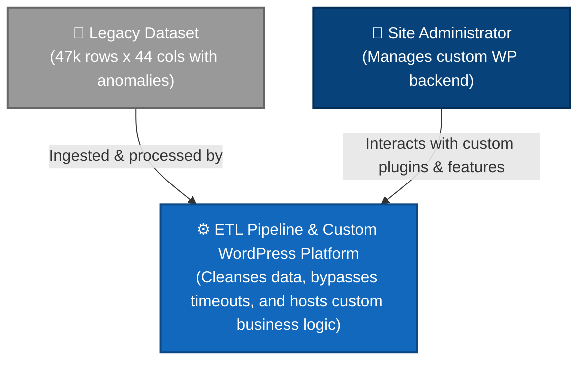
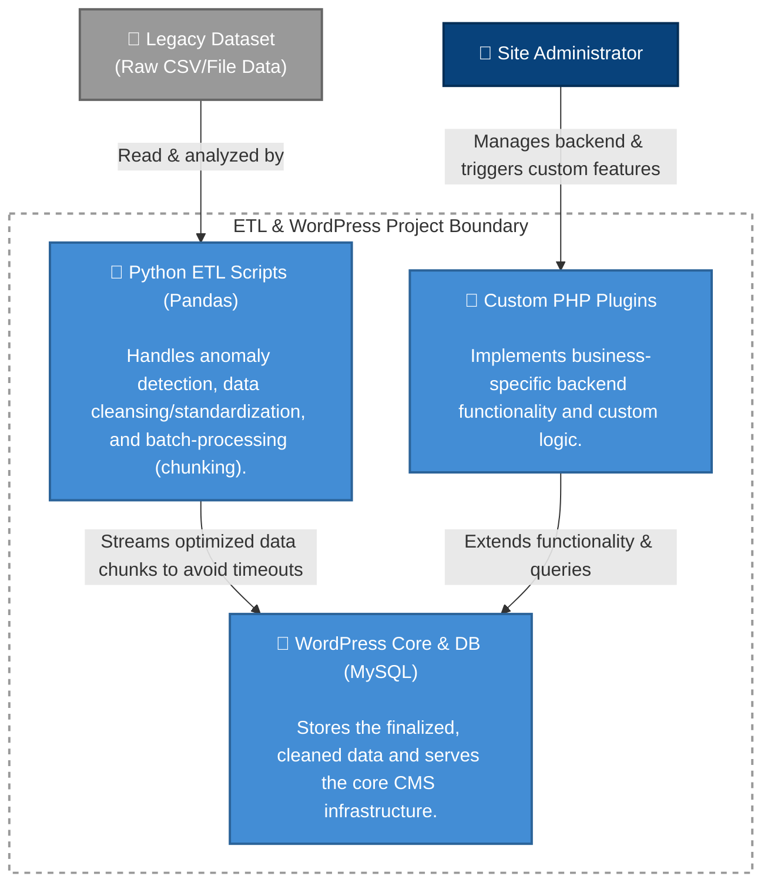
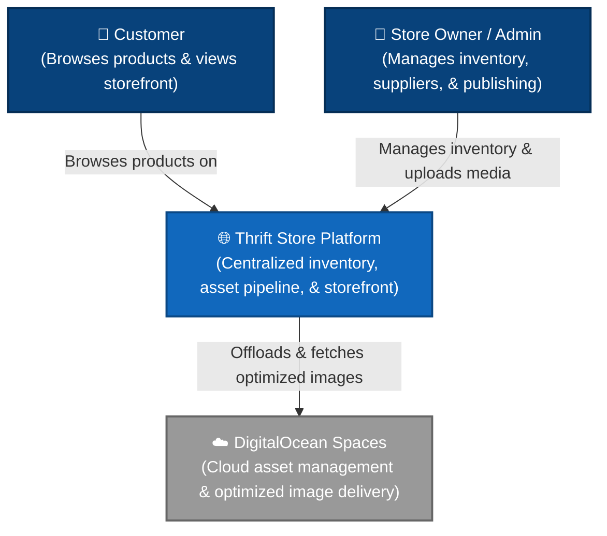
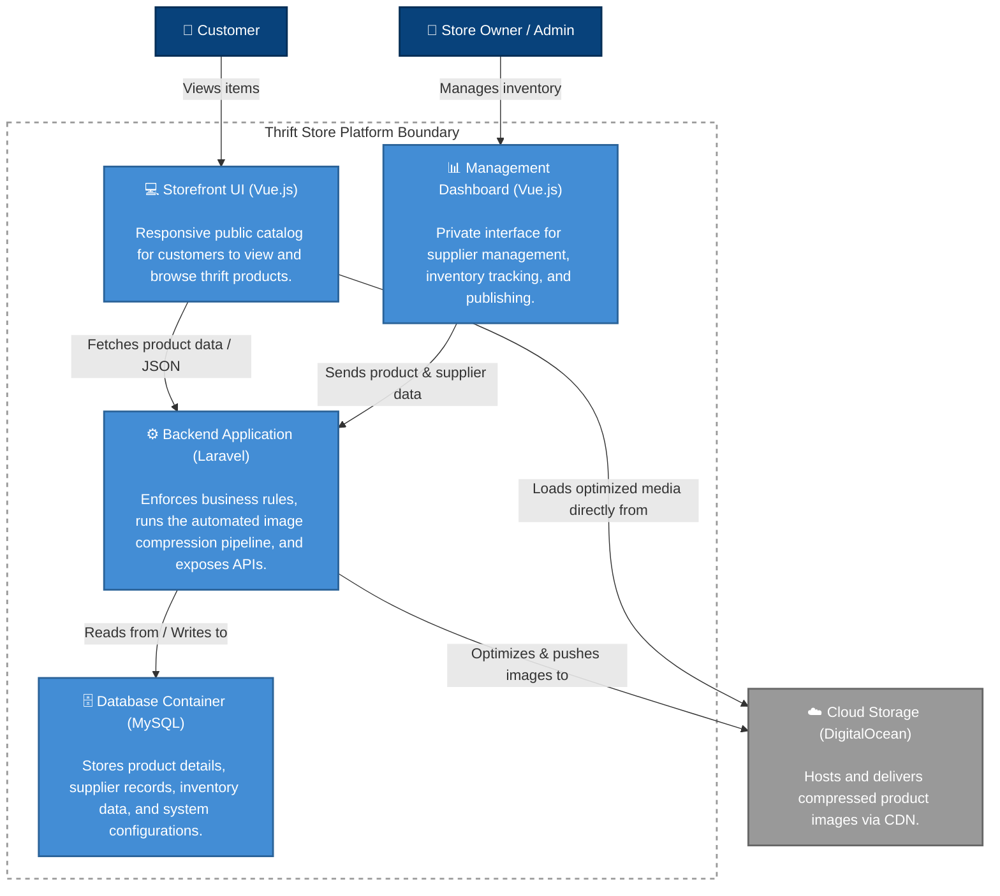
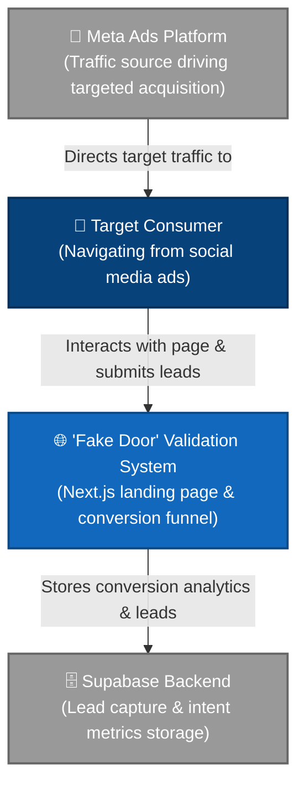
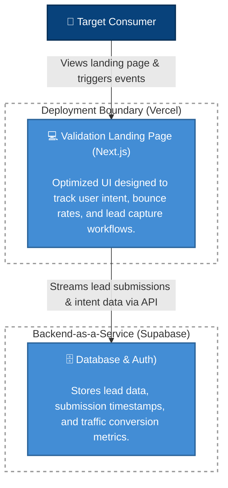

# Hi there, I'm Brunno Silva 👋

## About Me

Full-stack developer focused on Laravel, Vue.js, PHP, JavaScript, and designing software that solves real business problems.

My background combines software engineering, business process analysis, and real-world problem solving. Rather than building technology for its own sake, I enjoy identifying operational bottlenecks, validating ideas, and engineering practical solutions that create measurable business value.

My recent work includes SaaS development, business automation tools, e-commerce solutions, ETL pipelines, product validation experiments, and custom backend systems.

---

## 🔨 Currently Building

- Multi-tenant appointment booking SaaS (Laravel + Vue.js)
- Business automation tools
- Product validation experiments

---

## 🚀 Featured Projects & Case Studies

> 💡 **My Engineering Philosophy:** Every project below started with a real-world problem—an operational bottleneck, inefficient workflow, data challenge, or unvalidated business idea. My focus is understanding the root cause and building solutions that provide measurable business value.

Below is a selection of independent projects and technical case studies.

---

## 🛠️ Skills Demonstrated

- Laravel Architecture
- REST APIs
- Vue.js
- MySQL Database Design
- ETL Pipelines
- Data Cleansing & Transformation
- Payment Integration
- Business Process Analysis
- Process Automation
- Product Validation
- Authentication & Authorization
- Root Cause Analysis
- Performance Optimization
- Responsive Web Applications

---

<b>1. Automated Appointment SaaS</b> 🌐 <i>[Live Demo Not Available]</i>

 

### 🔗 Live Application Under Construction

🔒 *Codebase private to protect business logic (Technical walkthrough available upon request.)*

### The Problem

Business owners reported recurring frustrations with existing appointment platforms:

- No protection against client no-shows
- Limited payment integration options
- Poor feature-to-cost ratio
- Operational friction during the booking process

### The Solution

A full-stack Software-as-a-Service platform designed to automate appointment scheduling, payment processing, user management, and booking workflows.

### Engineering Challenges Solved

- Prevented double-booking conflicts through automated schedule validation
- Implemented role-based authentication and authorization
- Integrated payment verification before booking confirmation
- Built reusable Vue.js scheduling components
- Created scalable multi-tenant booking logic
- Developed a business onboarding hub supporting initial configuration and local business visibility

### Technical Highlights

- Laravel MVC/API architecture
- Vue.js frontend
- Stripe payment integration
- MySQL relational database design
- Business rules and validation layers
- Dynamic calendar scheduling

### Tech Stack

Laravel • Vue.js • MySQL • Stripe

### Status

✅ Core scheduling engine complete

🔄 Active development with ongoing UX and onboarding improvements

### Architecture Diagrams

#### Level 1: System Context

#### Level 2: Container Diagram

---

<b>2. Case Study: Legacy Data ETL & Custom WordPress Development</b> 📄 <i>[Technical Breakdown]</i>

 

🔒 *Proprietary client data and codebase (Architectural walkthrough and code snippets available upon request.)*

### The Problem

A large legacy dataset repeatedly failed during database import operations due to hidden formatting inconsistencies, malformed records, and server timeout limitations.

The failure points were difficult to identify because the errors appeared only during large-scale insertion attempts.

### The Solution

A combination of ETL analysis, data cleansing, anomaly detection, and custom automation scripts designed to isolate problematic records and optimize the import workflow.

### Key Accomplishments

#### Data Engineering & ETL

- Processed and analyzed a dataset containing **47,000 rows × 44 columns**
- Cleaned and standardized legacy data
- Identified hidden formatting anomalies impacting imports

#### Root Cause Analysis

- Identified **two malformed records** that prevented successful import of the entire dataset
- Reduced troubleshooting time by automating anomaly detection

#### Performance Optimization

- Developed Python batch-processing scripts
- Split large imports into optimized chunks
- Eliminated server timeout issues during data ingestion

#### WordPress Engineering

- Developed custom WordPress plugins tailored to project requirements
- Implemented business-specific backend functionality
- Leveraged AI-assisted development to accelerate delivery while maintaining functionality, readability, and maintainability

### Technical Skills Demonstrated

- Data Analysis
- ETL Workflows
- Debugging & Root Cause Investigation
- Python Automation
- Database Optimization
- WordPress Plugin Development
- PHP Backend Development

### Tech Stack

Python • WordPress • PHP • MySQL • Pandas

### Architecture Diagrams

#### Level 1: System Context

### Level 2: Container Diagram

---

<b>3. Smart Thrift Store Display & Business Management System</b> 🌐 <i>[Live Demo]</i>

 

### 🔗 Live Application

https://www.minottinoninha.com.br

🔒 *Codebase private (Technical walkthrough available upon request.)*

### The Problem

The client relied heavily on social media to showcase products to a growing customer base. Product presentation, inventory visibility, and business management processes were becoming increasingly repetitive and time-consuming.

### The Solution

A custom storefront and management platform that centralizes inventory, supplier information, product publishing, and business operations while enforcing business-specific validation rules.

### Business Impact

- Reduced repetitive manual product sharing workflows
- Centralized inventory and supplier management
- Streamlined product publication process
- Improved image delivery performance through automated optimization

### Engineering Highlights

- Automated image compression pipeline
- Cloud asset management and delivery
- Server-side business rule enforcement
- Product and supplier management dashboard
- Responsive customer-facing storefront

### Tech Stack

Laravel • Vue.js • MySQL • DigitalOcean Cloud Services

### Architecture Diagram

#### Level 1: System Context

#### Level 2: Container Diagram

---

<b>4. Product Validation "Fake Door" Experiment</b> 🌐 <i>[Live Case Study]</i>

 

### 🔗 Landing Page

https://www.smartcesta.com.br

🔒 *Analytics dashboard and backend are private.*

### The Problem

Building a full-scale product without validating demand introduces significant financial and development risk. Before investing months into implementation, I wanted measurable evidence of real market interest.

### The Solution

A lightweight validation system designed to measure actual consumer intent before any backend development began.

### Validation Approach

- Landing page development
- User intent tracking
- Lead capture workflow
- Conversion analytics
- Paid traffic acquisition testing

### Business Value

This project demonstrates a product-first approach to software development:

- Validate demand before investing heavily in development
- Collect real market feedback
- Measure customer acquisition costs early
- Reduce development risk through data-driven decisions

### Validation Metrics

#### Ad A — Paper List Pain

- Reach: **5,590**
- Landing Page Visits: **361**
- CTR: **4.78%**
- Cost per Visit: **R$ 0.28**

#### Ad B — Expensive Groceries and Low on Cash

- Reach: **7,375**
- Landing Page Visits: **388**
- CTR: **2.97%**
- Cost per Visit: **R$ 0.34**

**Overall Landing Page Bounce Rate:** **81%**

*Additional insights available during technical discussion.*

### Tech Stack

Next.js • Supabase • Vercel • Meta Ads

### Architecture Diagrams

#### Level 1: System Context

#### Level 2: Container Diagram

- 📫 [LinkedIn](www.linkedin.com/in/brunno-roberto-3334a6213)
- :email: brpdsdev@gmail.com  

